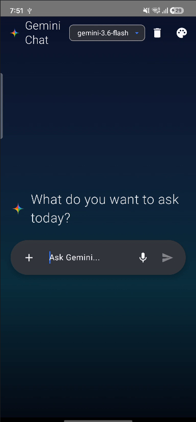
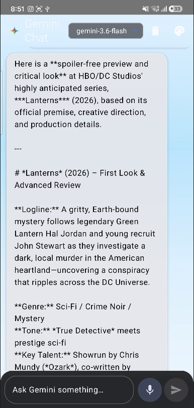
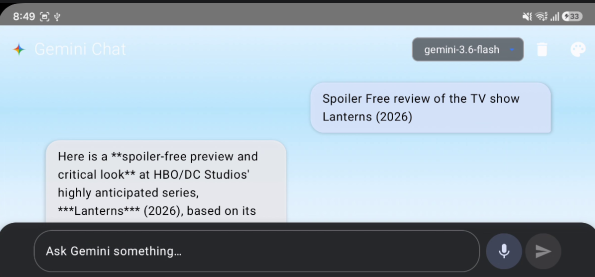
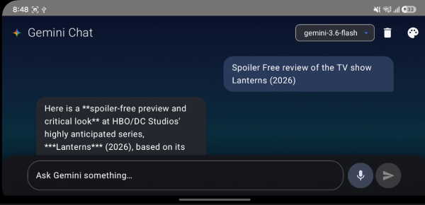
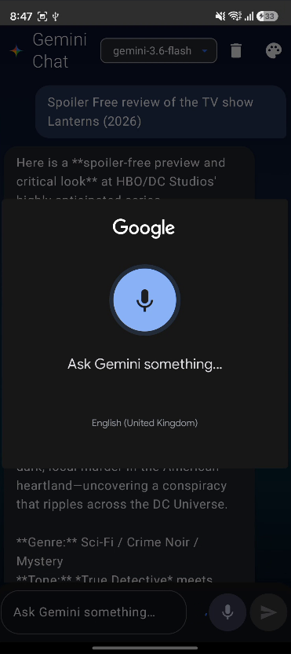
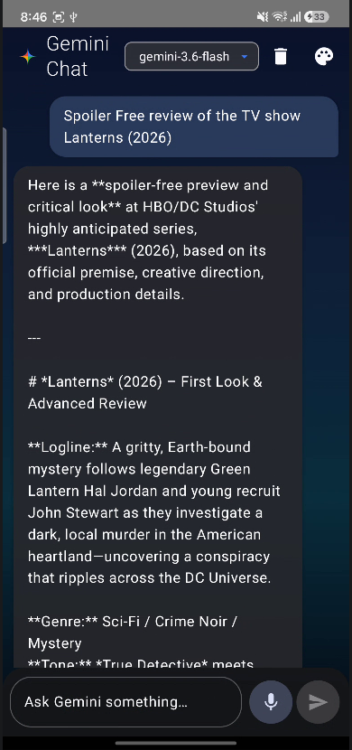
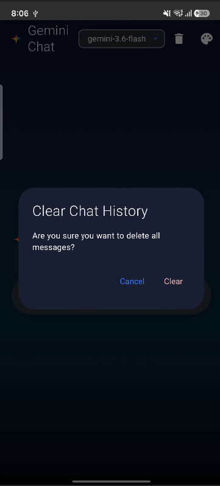

# Gemini Chat Assignment

## Summary

This project is a Kotlin Android chat app built with Jetpack Compose and
Material 3. It sends prompts to the Gemini `generateContent` REST API, stores
chat history locally with Room, supports voice input, and includes API-key
handling with Android Keystore encryption.

## Implemented Features

- Gemini-style chat UI built with Jetpack Compose and Material 3.
- Empty-state prompt screen with a rounded input bar.
- User and Gemini chat bubbles in a `LazyColumn`.
- Stable message IDs from Room and auto-scroll to the latest message.
- `StateFlow`-based `ChatViewModel` with lifecycle-aware state collection.
- Loading state with a typing indicator while Gemini is responding.
- Snackbar-based error display for failed requests.
- Voice input using `RecognizerIntent`.
- Model selector menu for Gemini model names.
- API-key notice dialog when switching models.
- Clear-chat action with a confirmation dialog.
- System, Light, and Dark theme options in the chat screen.
- Material You dynamic color support in the app theme.
- Adaptive phone/tablet spacing using `WindowSizeClass`.
- Room database for persisted conversation history.
- OkHttp client for Gemini REST API calls.
- JSON request/response parsing with Kotlin serialization.

## API-Key Handling

- `local.properties.example` contains only a placeholder key.
- `local.properties` is ignored by Git.
- Gradle reads `GEMINI_API_KEY` from `local.properties`.
- Gradle falls back to the `GEMINI_API_KEY` environment variable for CI or
  command-line builds.
- The key is exposed to the app through `BuildConfig.GEMINI_API_KEY`.
- `ApiKeyManager` encrypts the key using AES-256-GCM with Android Keystore.
- The encrypted key and IV are stored in DataStore.
- Data extraction rules exclude the encrypted key store from backup and device
  transfer.
- Release builds enable R8 minification and resource shrinking.

## Persistence

- `Room` stores chat messages in the `chat_messages` table.
- Messages include text, sender role, timestamp, and error state.
- The repository exposes stored messages as a `Flow`.
- Chat history can be cleared from the top app bar.
- A DataStore-based `UserPreferencesRepository` is present for theme, dynamic
  color, preferred name, and selected model values.

## Tests Included

- 5 JVM `ChatViewModel` tests:
  - successful send clears input and stops loading
  - failed send exposes an error message
  - blank input is ignored
  - clear chat removes messages
  - model selection shows the API-key notice
- 3 instrumented Compose UI tests:
  - send button appears for blank input
  - typing and tapping send invokes the callback path
  - user and Gemini messages are displayed

Run the tests with:

```bash
./gradlew test
./gradlew connectedAndroidTest
```

Create a release build with:

```bash
./gradlew assembleRelease
```

## Screenshots














