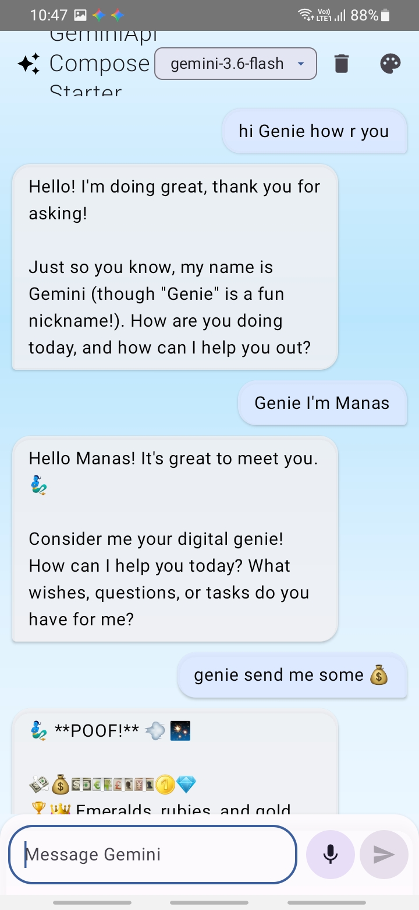
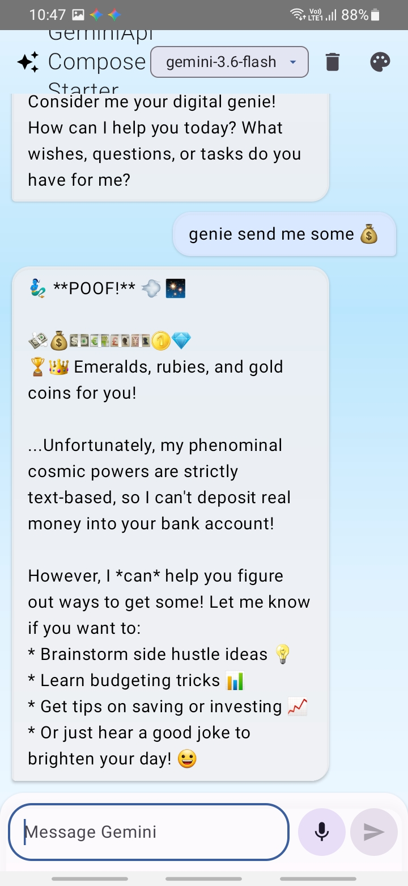

# Genie Wish Willow Assignment

## Overview

This is a Kotlin-based Android chat application developed using Jetpack Compose and Material 3. The application communicates with Google Gemini through the `generateContent` REST API, maintains conversation history locally using Room, provides speech-to-text input, and securely manages the Gemini API key through Android Keystore.

## Key Features

* Modern Gemini-inspired conversational interface developed with Jetpack Compose and Material 3.
* Initial screen containing suggested prompts and a rounded message input field.
* Separate chat bubbles for user messages and Gemini responses, rendered through `LazyColumn`.
* Database-generated message identifiers with automatic scrolling to the newest conversation entry.
* `ChatViewModel` using `StateFlow` for managing UI state and lifecycle-aware state observation.
* Animated/visual typing indicator displayed while a Gemini response is being generated.
* Snackbar notifications for communicating request and network-related errors.
* Speech-to-text functionality implemented through Android's `RecognizerIntent`.
* Dropdown-based selection between available Gemini models.
* Informational API-key dialog displayed when the selected model requires confirmation.
* Chat history deletion protected by a confirmation dialog.
* Support for System Default, Light, and Dark appearance modes.
* Material You dynamic color integration for supported Android devices.
* Responsive layouts with `WindowSizeClass` to accommodate both phones and tablets.
* Local conversation storage using the Room persistence library.
* OkHttp used as the networking layer for Gemini API communication.
* Kotlin Serialization used to encode API requests and decode responses.

## Secure API-Key Configuration

* A `local.properties.example` file is provided with a dummy API-key value rather than a real credential.
* The actual `local.properties` file is excluded from version control.
* Gradle retrieves the Gemini API key from `local.properties` during local builds.
* If the local property is unavailable, the build system checks the `GEMINI_API_KEY` environment variable, allowing use in CI environments and command-line builds.
* The retrieved key is made available to the application through `BuildConfig.GEMINI_API_KEY`.
* `ApiKeyManager` protects the API key using AES-256-GCM encryption backed by Android Keystore.
* The encrypted credential and its initialization vector are persisted through DataStore.
* Android backup and device-transfer rules prevent the encrypted key storage from being included in backups.
* Production builds use R8 for code shrinking and resource shrinking to reduce the final application size.

## Local Data Storage

* Conversation messages are persisted in a Room table named `chat_messages`.
* Each message records its content, sender type, timestamp, and whether it represents an error.
* The repository provides conversation updates through Kotlin `Flow`.
* Users can remove their complete conversation history through the top app bar.
* `UserPreferencesRepository` uses DataStore to retain settings such as theme selection, dynamic colors, preferred username, and the currently selected Gemini model.

## Testing

The project contains both unit tests and instrumented Compose UI tests.

### JVM Tests

Five `ChatViewModel` tests are included:

* Verifies that a successful message submission clears the input field and ends the loading state.
* Checks that unsuccessful API requests expose an appropriate error.
* Confirms that empty or whitespace-only messages are ignored.
* Ensures that the clear-chat operation deletes stored messages.
* Verifies that changing the Gemini model triggers the API-key information prompt.

### Compose UI Tests

Three instrumented UI tests are provided:

* Checks that the send control is visible when the message field is empty.
* Simulates entering text and pressing send to verify the expected callback flow.
* Confirms that both user-generated and Gemini-generated messages appear correctly in the conversation.

Run the tests with:

```bash
./gradlew test
./gradlew connectedAndroidTest
```

Create a release build with:

```bash
./gradlew assembleRelease
```

## Screenshots


